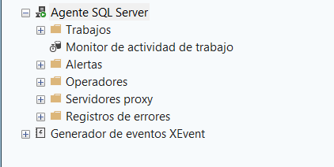

# 1. Iniciar SQL Server Agent

Antes de crear cualquier Job, hay que confirmar que el servicio de SQL Server Agent esté en ejecución. Si está detenido, ningún Job programado se ejecutará automáticamente.[^1]

**Qué hacer:** Iniciar el servicio de SQL Server Agent desde SSMS.

**Dónde hacerlo:** En el Explorador de objetos, expandir el servidor (`localhost`), localizar el nodo **Agente SQL Server**, hacer clic derecho sobre él y seleccionar **Iniciar**.

**Qué debe aparecer:** El ícono del nodo Agente SQL Server cambia para indicar que el servicio está en ejecución (deja de mostrar la marca de "detenido").

**Resultado esperado:** El nodo se expande correctamente y muestra sus componentes: Trabajos, Monitor de actividad de trabajo, Alertas, Operadores, Servidores proxy y Registros de errores.

<figure><figcaption>Agente SQL Server ya iniciado, mostrando sus componentes.</figcaption></figure>

> Si el nodo **Agente SQL Server** no aparece en el Explorador de objetos, generalmente es un tema de permisos: el usuario conectado necesita ser miembro de `sysadmin` o de uno de los roles de SQL Server Agent en `msdb` (ver [Requisitos previos](../requisitos-previos.md)).[^2]

[^1]: Microsoft. *Start, Stop, or Pause the SQL Server Agent Service*. Microsoft Learn. https://learn.microsoft.com/en-us/ssms/agent/start-stop-or-pause-the-sql-server-agent-service
[^2]: Microsoft. *Implement SQL Server Agent Security*. Microsoft Learn. https://learn.microsoft.com/en-us/ssms/agent/implement-sql-server-agent-security
