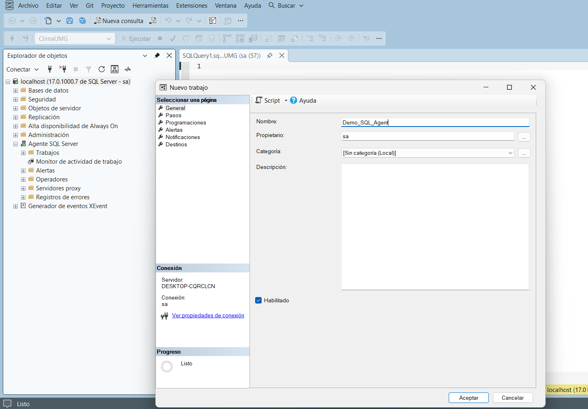

# 2. Crear el Job

Con el Agente ya iniciado, el siguiente paso es crear el **Job** (recuerda: un Job es la tarea completa que se quiere automatizar; ver [Conceptos básicos](../conceptos-basicos.md)).

## Entrar a Trabajos

**Qué hacer:** Abrir el asistente para crear un nuevo trabajo.

**Dónde hacerlo:** Agente SQL Server → **Trabajos** → clic derecho → **Nuevo trabajo...**

## Creación del trabajo (página General)

**Qué hacer:** Escribir el nombre del Job.

**Dónde hacerlo:** En la página **General** del cuadro **Nuevo trabajo**, en el campo **Nombre**, escribir `Demo_SQL_Agent`.

**Qué debe aparecer:** El campo Propietario se completa automáticamente con el inicio de sesión actual (`sa` en este manual), la categoría queda en *[Sin categoría (Local)]* y la casilla **Habilitado** aparece marcada por defecto.

<figure><figcaption>Página General del nuevo Job, con el nombre Demo_SQL_Agent.</figcaption></figure>

**Resultado esperado:** El Job todavía no está guardado en este punto — falta definir al menos un paso antes de poder aceptar el cuadro de diálogo. Continúa en la siguiente sección para crear el paso.

> Un Job puede tener una descripción y una categoría, pero no son obligatorias para que funcione. En este manual se dejaron con sus valores por defecto porque no eran necesarias para el objetivo de la práctica.
