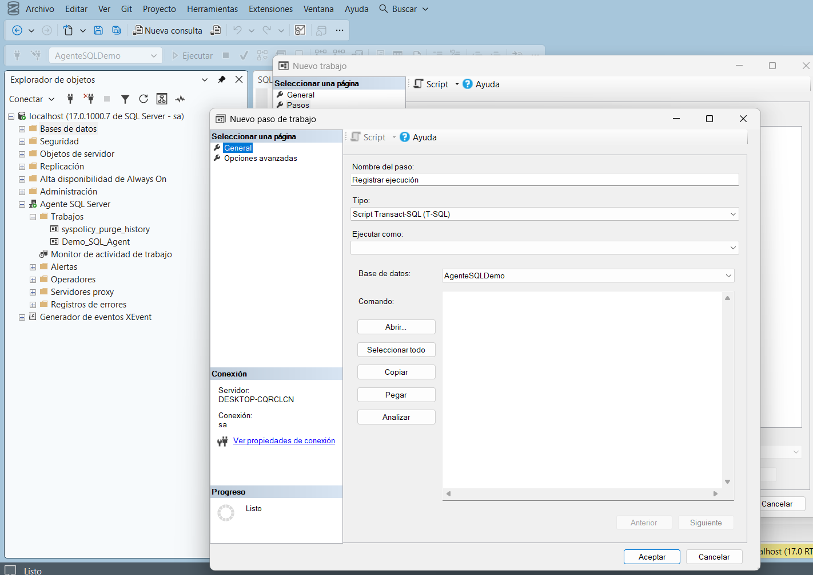
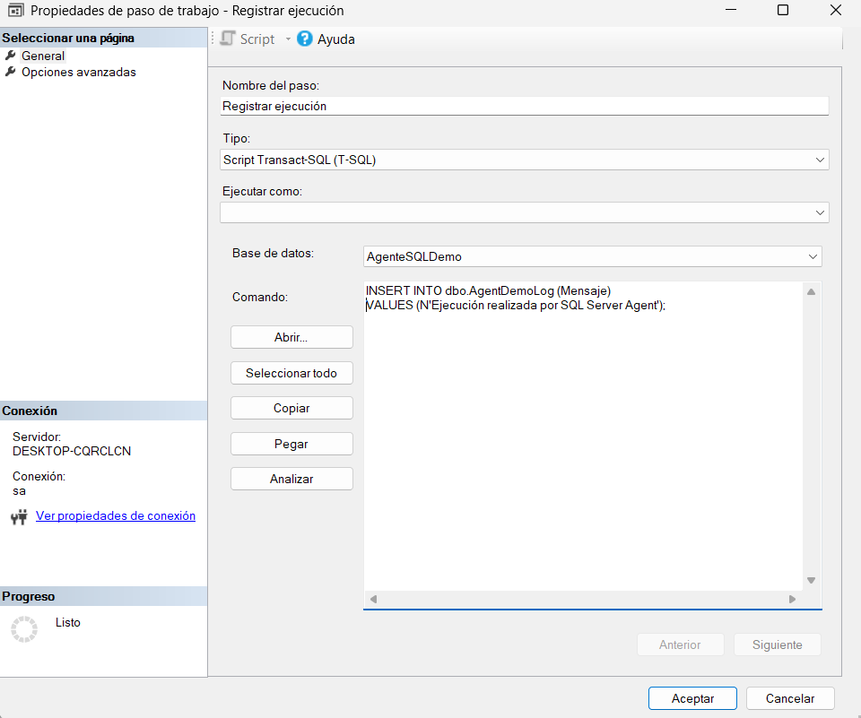
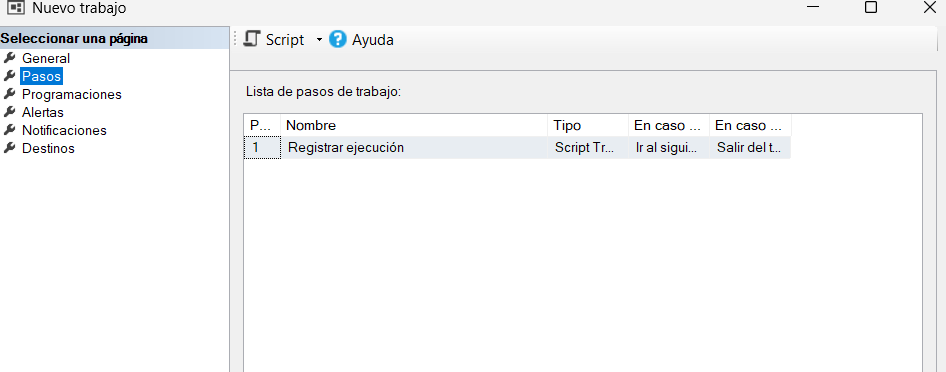

# 3. Crear el Job Step

Todo Job necesita al menos un **Job Step** (paso) para poder guardarse. Aquí se define exactamente qué comando se va a ejecutar.

## Crear el paso

**Qué hacer:** Abrir el asistente para agregar un nuevo paso al Job.

**Dónde hacerlo:** En el menú izquierdo del cuadro **Nuevo trabajo**, ir a **Pasos** → clic en **Nuevo...**

## Nombrar el paso y elegir el tipo

**Qué hacer:** Escribir el nombre del paso y confirmar su tipo.

**Dónde hacerlo:** En **Nombre del paso**, escribir `Registrar ejecución`. En **Tipo**, dejar seleccionado **Script Transact-SQL (T-SQL)**, que es el tipo por defecto para ejecutar comandos T-SQL.[^1]

## Seleccionar la base de datos

**Qué hacer:** Indicar sobre qué base de datos se ejecutará el comando del paso.

**Dónde hacerlo:** En el campo **Base de datos**, seleccionar `AgenteSQLDemo` (la base de datos de práctica creada previamente por el grupo para este ejercicio).

<figure><figcaption>Configuración inicial del paso Registrar ejecución, antes de escribir el comando.</figcaption></figure>

## Escribir el comando

**Qué hacer:** Escribir el comando T-SQL que el paso va a ejecutar.

**Dónde hacerlo:** En el cuadro **Comando**, escribir:

```sql
INSERT INTO dbo.AgentDemoLog (Mensaje)
VALUES (N'Ejecución realizada por SQL Server Agent');
```

**Qué debe aparecer:** El comando queda escrito en el cuadro de texto, listo para guardarse junto con el paso.

<figure><figcaption>Paso Registrar ejecución con el comando INSERT ya escrito.</figcaption></figure>

> **¿Qué hace este comando?** Inserta una fila nueva en la tabla `dbo.AgentDemoLog` (dentro de la base `AgenteSQLDemo`), con un mensaje fijo. Sirve como evidencia de que el Job realmente se ejecutó: cada vez que el Job corra, se agregará una fila nueva a esta tabla. Puedes usar el botón **Analizar** para comprobar que la sintaxis del comando es correcta antes de guardar.[^1]
>
> Este comando asume que la tabla `dbo.AgentDemoLog` ya existe en la base `AgenteSQLDemo`, con al menos una columna `Mensaje` compatible con texto. Si vas a reproducir este ejercicio en un entorno nuevo, esa tabla debe crearse antes de ejecutar el Job.

## Guardar el paso

**Qué hacer:** Confirmar el paso para agregarlo a la lista de pasos del Job.

**Dónde hacerlo:** Clic en **Aceptar** dentro del cuadro de propiedades del paso.

**Resultado esperado:** El paso `Registrar ejecución` aparece en la lista de **Pasos guardados** del Job, con el tipo *Script Tr...* (Transact-SQL), la acción "Ir al siguiente paso" en caso de éxito y "Salir del trabajo" en caso de error.

<figure><figcaption>El paso Registrar ejecución ya guardado en la lista de pasos del Job.</figcaption></figure>

[^1]: Microsoft. *Create a Transact-SQL Job Step*. Microsoft Learn. https://learn.microsoft.com/en-us/ssms/agent/create-a-transact-sql-job-step
