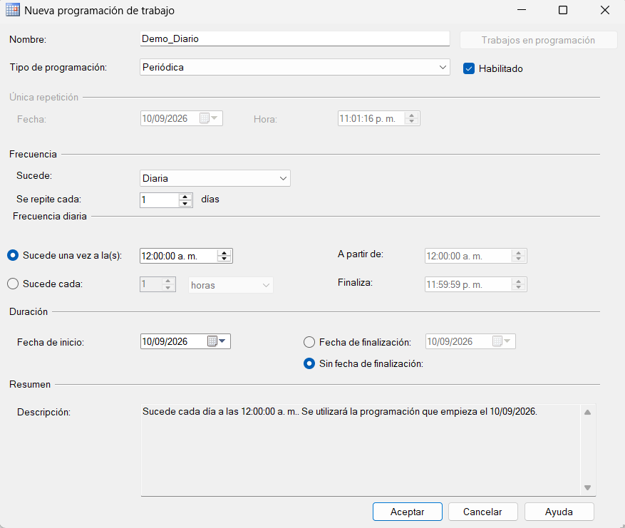

# 4. Crear la programación del Job (Schedule)

Con el paso ya guardado, el siguiente elemento es la **Schedule** (programación), que define cuándo se ejecutará el Job automáticamente (ver [Conceptos básicos](../conceptos-basicos.md)).[^1]

**Qué hacer:** Crear una nueva programación para el Job.

**Dónde hacerlo:** En el menú izquierdo del cuadro **Nuevo trabajo**, ir a **Programaciones** → clic en **Nueva...**

A continuación, completar el cuadro **Nueva programación de trabajo** con los siguientes valores:

| Campo | Valor usado en este manual |
|---|---|
| Nombre | `Demo_Diario` |
| Tipo de programación | Periódica |
| Sucede | Diaria |
| Se repite cada | 1 día |
| Frecuencia diaria | Sucede una vez a la(s) [hora indicada] |
| Habilitada | Sí |
| Duración | Sin fecha de finalización |

**Dónde hacerlo (detalle de cada campo):** En **Nombre**, escribir `Demo_Diario`. En **Tipo de programación**, seleccionar **Periódica**. En **Sucede**, seleccionar **Diaria**, y dejar **Se repite cada** en `1` día. Marcar la opción **Sucede una vez a la(s)** y dejar la hora que se desee. Dejar la programación **Habilitada** y, en la sección de duración, seleccionar **Sin fecha de finalización**.

**Qué debe aparecer:** En la sección **Resumen**, un texto que describe la programación en lenguaje natural, por ejemplo: *"Sucede cada día a las 12:00:00 a. m. Se utilizará la programación que empieza el [fecha]."*

<figure><figcaption>Programación Demo_Diario configurada para ejecutarse una vez al día.</figcaption></figure>

**Qué hacer para guardar:** Clic en **Aceptar** para guardar la programación.

**Resultado esperado:** La programación `Demo_Diario` queda asociada al Job `Demo_SQL_Agent`. A partir de este momento, mientras el servicio de SQL Server Agent esté en ejecución, el Job se ejecutará automáticamente todos los días a la hora configurada, además de poder ejecutarse manualmente en cualquier momento.

> Una misma programación puede reutilizarse en varios Jobs distintos. Si más adelante se modifica esa programación, el cambio afecta a todos los Jobs que la usan.[^1]

[^1]: Microsoft. *Create and Attach Schedules to Jobs*. Microsoft Learn. https://learn.microsoft.com/en-us/ssms/agent/create-and-attach-schedules-to-jobs
