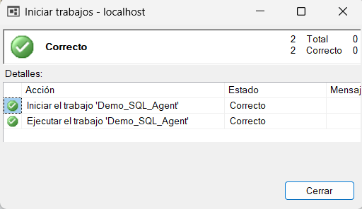
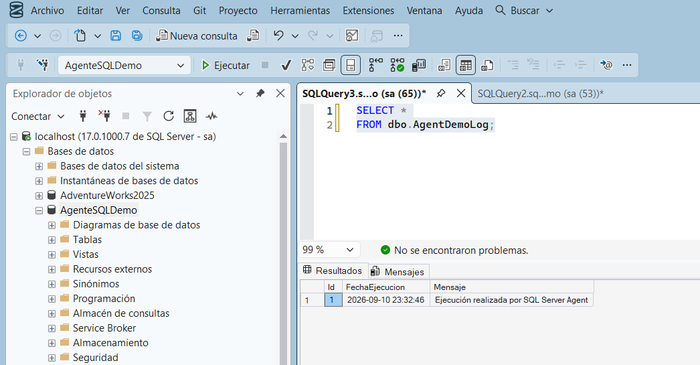

# 5. Ejecutar el Job manualmente y verificar el resultado

Aunque el Job ya quedó programado para ejecutarse todos los días, no es necesario esperar a la hora programada para comprobar que funciona: se puede iniciar manualmente en cualquier momento.[^1]

## Ejecutar el trabajo manualmente

**Qué hacer:** Iniciar la ejecución del Job de forma manual.

**Dónde hacerlo:**
1. En **Agente SQL Server → Trabajos**, localizar `Demo_SQL_Agent`.
2. Hacer **clic derecho** sobre `Demo_SQL_Agent`.
3. Seleccionar **Iniciar trabajo en el paso...**

**Qué debe aparecer:** Un cuadro **Iniciar trabajos - localhost** que muestra el progreso de la ejecución, con un ícono verde y el texto **Correcto**, junto con el total de acciones realizadas (2 de 2 correctas: iniciar el trabajo y ejecutarlo).

<figure><figcaption>El Job Demo_SQL_Agent se ejecutó correctamente.</figcaption></figure>

**Resultado esperado:** El Job termina sin errores. Si en cambio el resultado mostrara un ícono en rojo o la palabra "Correcto" no apareciera, el Job habría fallado (ver [Solución de problemas](../solucion-de-problemas.md)).

## Comprobar el resultado en la base de datos

**Qué hacer:** Consultar la tabla de bitácora para confirmar que el paso realmente insertó un registro.

**Dónde hacerlo:** Abrir una nueva consulta sobre la base de datos `AgenteSQLDemo` y ejecutar:

```sql
SELECT *
FROM dbo.AgentDemoLog;
```

**Qué debe aparecer:** Una fila de resultado con un `Id`, una `FechaEjecucion` (con la fecha y hora en que se ejecutó el Job) y el mensaje `Ejecución realizada por SQL Server Agent`.

<figure><figcaption>La consulta confirma que el paso del Job insertó el registro esperado.</figcaption></figure>

**Resultado esperado:** Cada vez que el Job se ejecute (manualmente o por su programación diaria), aparecerá una fila nueva en esta tabla. Esta consulta es, en este ejercicio, la forma más directa de comprobar que la automatización realmente funcionó.

[^1]: Microsoft. *Start a SQL Server Agent job*. Microsoft Learn. https://learn.microsoft.com/en-us/ssms/agent/start-a-job
