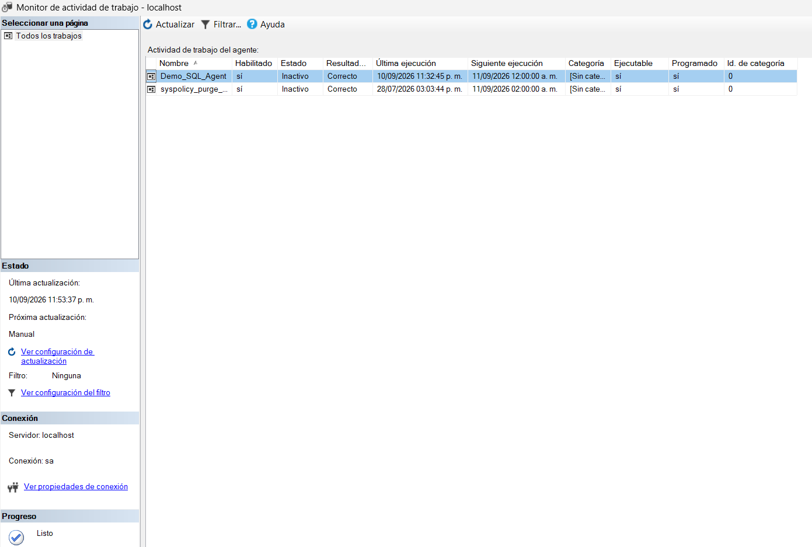

# 6. Consultar el estado del Job con el Job Activity Monitor

Además de consultar la tabla directamente, SSMS ofrece una pantalla dedicada para ver el estado de todos los Jobs del servidor: el **Monitor de actividad de trabajo** (Job Activity Monitor).[^1]

**Qué hacer:** Abrir el Monitor de actividad de trabajo.

**Dónde hacerlo:** En Agente SQL Server, clic derecho sobre **Monitor de actividad de trabajo** → **Ver actividad de trabajo**.

**Qué debe aparecer:** Una tabla con todos los Jobs definidos en el servidor. Para `Demo_SQL_Agent` se puede observar:

* **Habilitado:** sí
* **Estado:** Inactivo (no se está ejecutando en este momento)
* **Resultado:** Correcto
* **Última ejecución:** fecha y hora de la ejecución más reciente
* **Siguiente ejecución:** fecha y hora en que el Job volverá a ejecutarse según su programación

<figure><figcaption>El Job Demo_SQL_Agent visto desde el Monitor de actividad de trabajo.</figcaption></figure>

**Resultado esperado:** Confirmar, de un vistazo y sin tener que abrir el historial detallado, que el Job está habilitado y que su última ejecución fue exitosa.

> Desde esta misma pantalla también se pueden **iniciar**, **detener**, **habilitar/deshabilitar** o **eliminar** Jobs haciendo clic derecho sobre ellos, incluso seleccionando varios a la vez.[^1] Esto se retoma en [Administración básica de Jobs](../administracion-basica-jobs.md).

[^1]: Microsoft. *Job Activity Monitor*. Microsoft Learn. https://learn.microsoft.com/en-us/ssms/agent/job-activity-monitor
