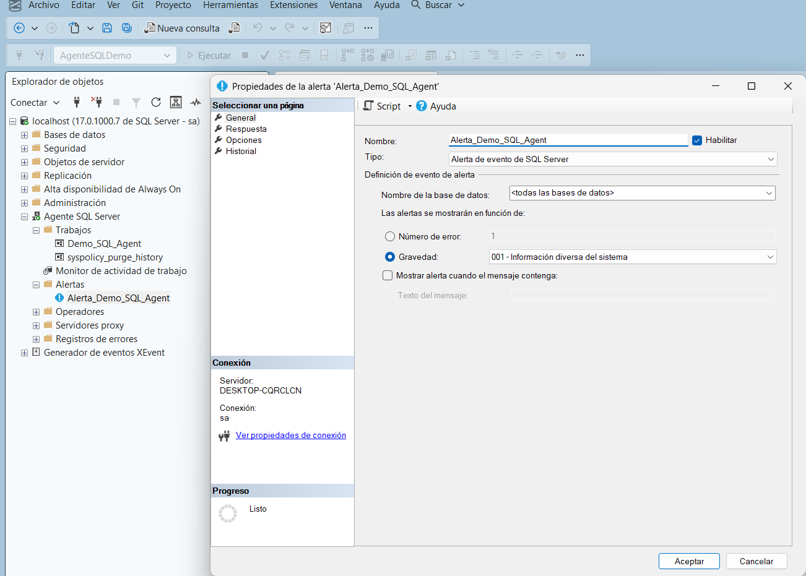
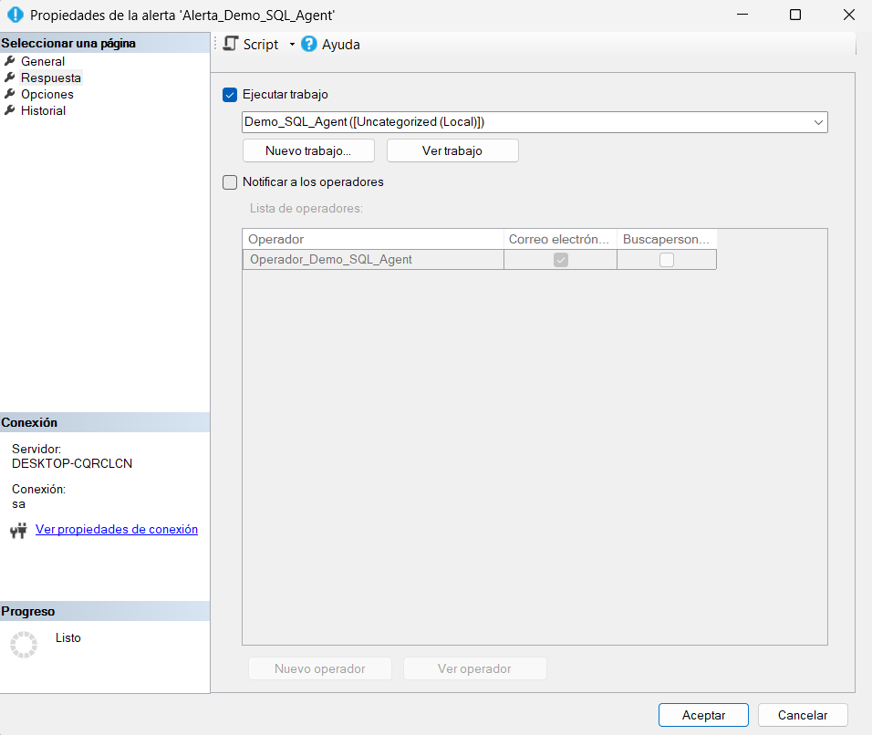

# 7. Crear una Alerta

Una vez que el Job funciona correctamente, se puede complementar con una **Alerta**: una respuesta automática de SQL Server Agent ante un evento del servidor (ver [Conceptos básicos](../conceptos-basicos.md)).[^1]

## Crear la alerta

**Qué hacer:** Abrir el asistente para crear una nueva alerta.

**Dónde hacerlo:** En Agente SQL Server, clic en la flechita ▶ para desplegar el árbol, localizar **Alertas**, clic derecho sobre **Alertas** → **Nueva alerta...**

**Qué hacer (página General):** Configurar el nombre y el tipo de la alerta.

**Dónde hacerlo:** En **Nombre**, escribir `Alerta_Demo_SQL_Agent`. En **Tipo**, dejar **Alerta de evento de SQL Server**. En **Nombre de la base de datos**, dejar `<todas las bases de datos>`. En "Las alertas se mostrarán en función de", seleccionar **Gravedad** y elegir **001 - Información diversa del sistema**.

<figure><figcaption>Configuración general de la alerta Alerta_Demo_SQL_Agent.</figcaption></figure>

> Los niveles de gravedad ("severity") de SQL Server van del 0 al 25: los niveles bajos (0-10) son mensajes informativos, los niveles intermedios (11-16) suelen ser errores que el propio usuario puede corregir, y los niveles más altos (17 en adelante) indican problemas de recursos o del motor que normalmente requieren intervención de un administrador.[^2] En este ejercicio se usó el nivel 001 (informativo) porque el objetivo era demostrar el mecanismo de la alerta, no responder a un error real del servidor.

## Configurar la respuesta de la alerta

**Qué hacer:** Definir qué debe pasar cuando la alerta se dispare.

**Dónde hacerlo:** Dentro del mismo cuadro de propiedades de la alerta, ir a la página **Respuesta**. Marcar la casilla **Ejecutar trabajo** y seleccionar el Job `Demo_SQL_Agent`. Opcionalmente, marcar **Notificar a los operadores** y seleccionar el operador correspondiente en la lista.

<figure><figcaption>Respuesta configurada: la alerta puede ejecutar el Job Demo_SQL_Agent y notificar al operador.</figcaption></figure>

**Qué debe aparecer:** El Job `Demo_SQL_Agent` queda seleccionado como acción de respuesta, y el operador `Operador_Demo_SQL_Agent` aparece disponible en la lista de operadores a notificar.

**Resultado esperado:** Si el evento configurado en la alerta ocurre en el servidor, SQL Server Agent ejecutará automáticamente el Job `Demo_SQL_Agent` y, si se marcó la notificación, avisará al operador correspondiente.

> Para que la notificación por correo realmente llegue a un operador, es necesario que **Database Mail** esté configurado en la instancia; sin eso, la alerta puede ejecutar el Job igual, pero no podrá enviar el correo.[^3]
>
> **[Captura recomendada]:** una vista de la lista de Alertas ya creada dentro del árbol de Agente SQL Server, similar a como aparece para Trabajos y Operadores, ayudaría a confirmar visualmente que la alerta quedó guardada.

[^1]: Microsoft. *Monitor and Respond to Events*. Microsoft Learn. https://learn.microsoft.com/en-us/ssms/agent/monitor-and-respond-to-events
[^2]: Microsoft. *Database Engine Error Severities*. Microsoft Learn. https://learn.microsoft.com/en-us/sql/relational-databases/errors-events/database-engine-error-severities
[^3]: Microsoft. *SQL Server Agent alerts*. Microsoft Learn. https://learn.microsoft.com/en-us/ssms/agent/alerts
