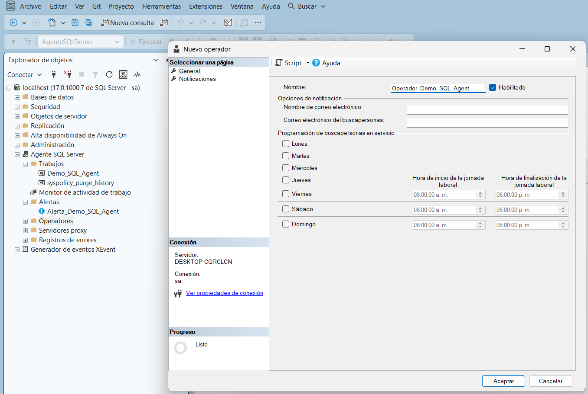

# 8. Crear un Operador

Para que una alerta pueda notificar a alguien, primero debe existir un **Operador**: el alias que representa a la persona (o su correo) que va a recibir la notificación (ver [Conceptos básicos](../conceptos-basicos.md)).[^1]

> En la práctica, el operador `Operador_Demo_SQL_Agent` se creó **antes** de configurar la página de Respuesta de la alerta (sección anterior), ya que para poder seleccionar un operador en la lista de notificación, el operador debe existir primero. Se documenta aquí, después de la alerta, para mantener el orden temático del manual: primero la alerta y su propósito, después quién la recibe.

**Qué hacer:** Abrir el asistente para crear un nuevo operador.

**Dónde hacerlo:** En Agente SQL Server, localizar **Operadores** → clic derecho sobre **Operadores** → **Nuevo operador...**

**Qué hacer (página General):** Escribir el nombre del operador y, si se desea, su correo de notificación.

**Dónde hacerlo:** En **Nombre**, escribir `Operador_Demo_SQL_Agent`. Dejar la casilla **Habilitado** marcada. Los campos **Nombre de correo electrónico** y **Correo electrónico del buscapersonas** son opcionales; en este ejercicio se dejaron en blanco porque el objetivo era demostrar la creación del operador, no configurar el envío real de notificaciones.

<figure><figcaption>Configuración del operador Operador_Demo_SQL_Agent.</figcaption></figure>

**Resultado esperado:** El operador `Operador_Demo_SQL_Agent` queda disponible para ser seleccionado desde la página de Respuesta de cualquier alerta, tal como se usó en el paso anterior.

> Solo los miembros del rol `sysadmin` pueden crear operadores.[^1] Además, para que un operador reciba notificaciones por correo de forma real, el servidor debe tener **Database Mail** configurado y habilitado; sin esa configuración, el operador puede crearse sin problema, pero no llegará ningún correo.[^2]

[^1]: Microsoft. *Create an Operator*. Microsoft Learn. https://learn.microsoft.com/en-us/ssms/agent/create-an-operator
[^2]: Microsoft. *SQL Server Agent alerts*. Microsoft Learn. https://learn.microsoft.com/en-us/ssms/agent/alerts
