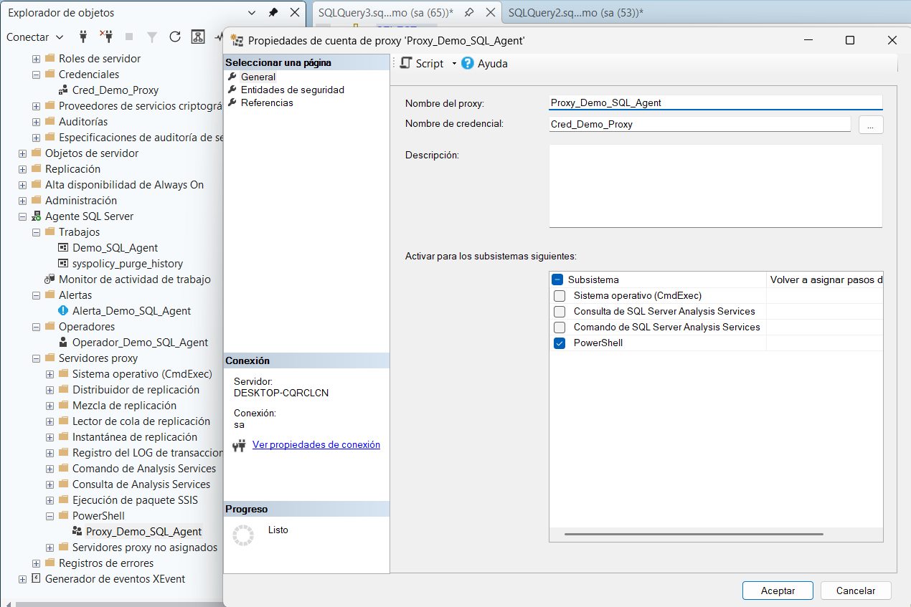

# 9. Crear una Credencial y un Proxy

El último elemento de este procedimiento es el **Proxy**, que permite que un paso de trabajo se ejecute con un contexto de seguridad distinto al del propietario del Job (ver [Conceptos básicos](../conceptos-basicos.md)). Antes de crear el proxy, es necesario crear la **credencial** en la que se va a apoyar.[^1]

## Crear la credencial

**Qué hacer:** Crear una credencial que contenga las credenciales de Windows que usará el proxy.

**Dónde hacerlo:** En el Explorador de objetos, ir a **Seguridad** (a nivel de servidor, no dentro de una base de datos) → clic derecho en **Credenciales** → **Nueva credencial...** Asignar el nombre `Cred_Demo_Proxy` e indicar la cuenta de Windows correspondiente en el campo de identidad.

**Resultado esperado:** La credencial `Cred_Demo_Proxy` aparece dentro de **Seguridad → Credenciales**, lista para asociarse a uno o varios proxies.

> La cuenta especificada en la credencial debe tener el permiso de Windows "Access this computer from the network" (`SeNetworkLogonRight`) en el equipo donde corre SQL Server, para que el proxy pueda funcionar correctamente.[^1]

## Crear el proxy

**Qué hacer:** Crear un proxy que use la credencial anterior y habilitarlo para el subsistema que se necesita.

**Dónde hacerlo:** En Agente SQL Server → **Servidores proxy** → **PowerShell** → clic derecho → **Nuevo proxy...**

Configurar el proxy con los siguientes valores:

| Campo | Valor usado en este manual |
|---|---|
| Nombre del proxy | `Proxy_Demo_SQL_Agent` |
| Nombre de credencial | `Cred_Demo_Proxy` |
| Subsistemas activos | ☑ PowerShell |

**Qué debe aparecer:** En la lista de subsistemas de la página General del proxy, la casilla **PowerShell** queda marcada, junto con la casilla general **Subsistema** en la parte superior de la tabla.

<figure><figcaption>Proxy Proxy_Demo_SQL_Agent configurado con la credencial Cred_Demo_Proxy, habilitado para el subsistema PowerShell.</figcaption></figure>

**Resultado esperado:** El proxy `Proxy_Demo_SQL_Agent` queda disponible para asignarse como cuenta de ejecución ("Ejecutar como") en cualquier Job Step de tipo **PowerShell**, permitiendo que ese paso se ejecute con los permisos de la cuenta de Windows definida en `Cred_Demo_Proxy`, en lugar de usar la cuenta del servicio de SQL Server Agent.[^1]

> Crear un proxy no cambia los permisos que la cuenta de la credencial ya tiene en el sistema operativo o en la red: si esa cuenta no tiene permiso para hacer algo, el paso que use el proxy tampoco podrá hacerlo.[^1] Solo los miembros del rol `sysadmin` pueden crear proxies; otros usuarios pueden usarlos si se les concede acceso explícitamente.[^1]

[^1]: Microsoft. *Create a SQL Server Agent Proxy*. Microsoft Learn. https://learn.microsoft.com/en-us/ssms/agent/create-a-sql-server-agent-proxy
